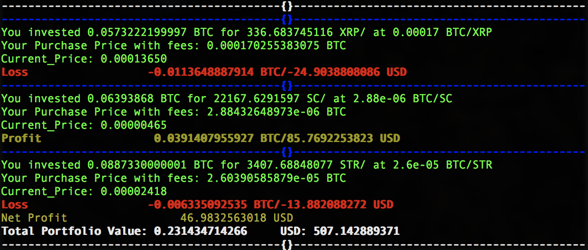

# Polo Stats 

This program gives detailed overview of your last trades based on your current poloniex balances

## Installation

1) Clone the repository 
```
git clone https://github.com/araa47/PoloniexProfit.git 
```

2) Cd into the repository 
```
cd PoloniexProfit 
```

3) You can either install the python libraries to your system by following A 
   or install them in a virtualenv by following B 


##### A

1) Install to usr/local python library

```
sudo pip install -r requirements.txt 
```

##### B 

1) Cd to a directory outside

```
cd ..
```

2) Create a virtualenviroment , here i have named mine pypolo

```
virtualenv pypolo 
```

3) Activate the virtualenvironment

```
source pypolo/bin/activate
```

4) Cd into the project
```
cd PoloniexProfit 
```
5) Now locally install the requirements
```
pip install -r requirements.txt
```


## API Key Configuration 

1) Open sample_apikey.py and enter your poloniex api key and secret 

2) Rename the file to apikey.py 

## Running 

```
python stats.py 

```
## Mock Output



## Extra Details 

1) Currently the program only calculate BTC to other currency trades 

2) The program only works on the latest trade history 

3) The program will miss out your total BTC balance while calculating Net_Overview